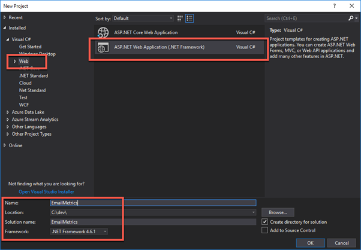
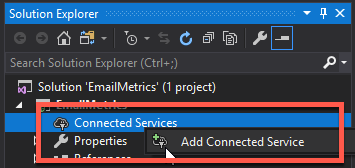
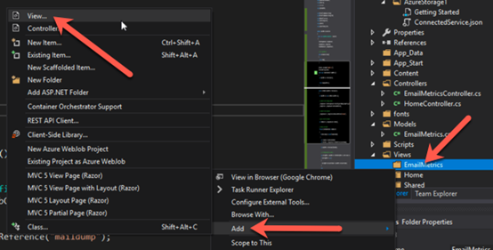

## Create a new ASP.NET project

1. Open Visual Studio and select **File > New > Project**.
2. In the **New Project** dialog, do the following:
   1. Select **Templates > Visual C# > Web**.
   1. Select **ASP.NET Web Application (.NET Framework)**.
   1. Enter **EmailMetrics** for the name of the project.
    

    > [!IMPORTANT]
    > Ensure that you enter the exact same name for the Visual Studio Project that is specified in these lab instructions. The Visual Studio Project name becomes part of the namespace in the code. The code inside these instructions depends on the namespace matching the Visual Studio Project name specified in these instructions. If you use a different project name the code will not compile unless you adjust all the namespaces to match the Visual Studio Project name you enter when you create the project.

   1. Select **OK**. In the **New ASP.NET Web Application Project** dialog, select **MVC** and select **OK**.

## Add and configure your Azure Storage as a Connected Service

1. In the **Solution Explorer** tool window, right-click the **Connected Services** node and select **Add Connected Service**.

2. On the **Connected Services** dialog, select **Cloud Storage with Azure Storage**.
3. On the **Azure Storage** dialog, select the storage account where you exported the data to in the previous exercise and select **Add**.
4. This will install the necessary NuGet packages for the project.

## Create a new model class that will be used to store the email metrics

a. In the  **Solution Explorer** tool window, right-click the Models folder and select Add > Class.
b. In the Add New Item dialog, select Class, set the name of the file to EmailMetric.cs and select Add.
c. Add the following code to the class EmailMetric you just created:

```csharp
public string Email;
public double RecipientsToEmail;
```

## Create a new controller that will calculate and display the results

1. Right-click the **Controllers** folder and select **Add > Controller**.
2. In the **Add Scaffold** dialog, select **MVC 5 Controller - Empty** and select **Add**.
3. When prompted, name the controller **EmailMetricsController** and select **OK**.
4. Add the following using statements after the existing using statements at the top of the file containing the **EmailMetricsController** class:

    ```csharp
    using Microsoft.WindowsAzure.Storage;
    using Microsoft.WindowsAzure.Storage.Blob;
    using Newtonsoft.Json.Linq;
    using System.Configuration;
    using System.IO;
    using System.Threading.Tasks;
    ```

5. Add the following code to the **EmailMetricsController** class. These will be used to connect to the Azure Storage Account that contain the exported data:

    ```csharp
    CloudStorageAccount _storageAccount;
    CloudBlobClient _storageClient;
    CloudBlobContainer _storageContainer;
    ```

6. Add the following method to the **EmailMetricsController** class. This will process an Azure blob and update a collection representing the email accounts and how many recipients there were combined across all emails found for the extracted accounts:

    ```csharp
    private void ProcessBlobEmails(List<Models.EmailMetric> emailMetrics, CloudBlob emailBlob)
    {
        using (var reader = new StreamReader(emailBlob.OpenRead()))
        {
            string line;
            while ((line = reader.ReadLine()) != null)
            {
                var jsonObj = JObject.Parse(line);

                // extract sender
                var sender = jsonObj.SelectToken("Sender.EmailAddress.Address")?.ToString();

                // extract and count up recipients
                var totalRecipients = 0;
                totalRecipients += jsonObj.SelectToken("ToRecipients").Children().Count();
                totalRecipients += jsonObj.SelectToken("CcRecipients").Children().Count();
                totalRecipients += jsonObj.SelectToken("BccRecipients").Children().Count();

                var emailMetric = new Models.EmailMetric();
                emailMetric.Email = sender;
                emailMetric.RecipientsToEmail = totalRecipients;

                // if already have this sender...
                var existingMetric = emailMetrics.FirstOrDefault(metric => metric.Email == emailMetric.Email);
                if (existingMetric != null)
                {
                    existingMetric.RecipientsToEmail += emailMetric.RecipientsToEmail;
                }
                else
                {
                    emailMetrics.Add(emailMetric);
                }
            }
        }
    }
    ```

7. Add the following method to the **EmailMetricsController** class. This will enumerate through all blobs in the specified Azure Storage account's specified container and send each one to `ProcessBlobEmails()` method added in the last step:

    ```csharp
    private List<Models.EmailMetric> ProcessBlobFiles()
    {
        var emailMetrics = new List<Models.EmailMetric>();

        // connect to the storage account
        _storageAccount = CloudStorageAccount.Parse(ConfigurationManager.AppSettings["AzureStorageConnectionString-1"]);
        _storageClient = _storageAccount.CreateCloudBlobClient();

        // connect to the container
        _storageContainer = _storageClient.GetContainerReference("maildump");

        // get a list of all emails
        var blobResults = _storageContainer.ListBlobs();

        // process each email
        foreach (IListBlobItem blob in blobResults)
        {
            if (blob.GetType() == typeof(CloudBlockBlob))
            {
                var cloudBlob = (CloudBlockBlob)blob;
                var blockBlob = _storageContainer.GetBlobReference(cloudBlob.Name);

                ProcessBlobEmails(emailMetrics, blockBlob);
            }
        }

        return emailMetrics;
    }
    ```

8. Add the following action to the **EmailMetricsController** that will use the methods added this class to process the emails and send the results to the view:

    ```csharp
    [HttpPost, ActionName("ShowMetrics")]
    [ValidateAntiForgeryToken]
    public ActionResult ShowMetrics()
    {
        var emailMetrics = ProcessBlobFiles();

        return View(emailMetrics);
    }
    ```

## Create a new view for the EmailMetrics index action

1. In the  **Solution Explorer** tool window, right-click the **Views > EmailMetrics** folder and select **Add > View**.

2. In the **Add View** dialog, set the View name to **Index**, leave the remaining input controls to their default values, and select **Add**.

3. Update the markup in the new Views/EmailMetrics/Index.cshtml to the following. This will add a form with a single button that will submit an HTTP POST to the custom controller action added in the last step:

    ```html
    @{
    ViewBag.Title = "Index";
    }

    <h2>Email Metrics</h2>
    ```

4. This application will look at the email data for emails extracted to the Azure Blob Storage account and display the total number of recipients from each sender.

    ```html
    @using (Html.BeginForm("ShowMetrics", "EmailMetrics", FormMethod.Post))
    {
    @Html.AntiForgeryToken()
    <div>
        <button type="submit">View email metrics</button>
    </div>

    <div>
        <em>Please be patient as this can take a few moments to calculate depending on the size of the exported data...</em>
    </div>
    }
    ```

## Create a new view for the EmailMetrics ShowMetrics action

1. In the **Solution Explorer** tool window, right-click the **Views > EmailMetrics** folder and select **Add > View**.
2. In the **Add View** dialog, set the following values and leave the remaining input controls to their default values and select **Add**:
   1. **View name**: ShowMetrics
   2. **Template**: List
   3. **Model class**: EmailMetric (EmailMetric.Models)
    
3. Update the markup in the new _Views/EmailMetrics/ShowMetrics.cshtml_ to the following. This will display the results of the calculations.

```html
@model IEnumerable<EmailMetrics.Models.EmailMetric>

@{
  ViewBag.Title = "ShowMetrics";
}

<h2>Email Metrics</h2>

<table class="table">
  <tr>
    <th>Sender</th>
    <th>Number of Recipients</th>
  </tr>

  @foreach (var item in Model)
  {
  <tr>
    <td>@Html.DisplayFor(modelItem => item.Email)</td>
    <td>@Html.DisplayFor(modelItem => item.RecipientsToEmail)</td>
  </tr>
  }

</table>
```

## Update the navigation to have a way to get to the new controller

1. In the **Solution Explorer** tool window, locate and open the file _Views/Shared/_Layout.cshtml_.
2. Replace the following line...

```html
<li>@Html.ActionLink("Contact", "Contact", "Home")</li>

... with the following line to update the menu item:

<li>@Html.ActionLink("Email Metrics", "Index", "EmailMetrics")</li>
```

## Test the application

1. In Visual Studio, select **Debug > Start Debugging**.
2. When the application is built and loads in a new browser window, select the **Email Metrics** item in the top navigation bar.
3. On the **Email Metrics** page, select the **View email metrics** button.
   
4. When the page loads, you will see a list of emails addresses that were found among all emails with a sum of all the recipients sent between them, as shown from a small sample set in a test email extract in the following figure.

